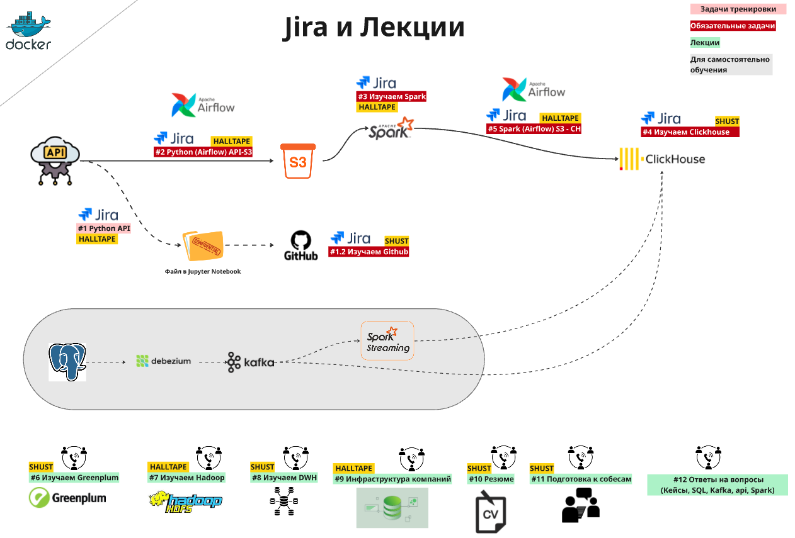

# Bootcamp

<p align="center">
    
</p>

## 🚀 Подключение к сервисам и СУБД

Все ссылки на инструменты находятся здесь!

[BootCampPage](http://start.bootcamp.local)

### Основные компоненты
- **Airflow** - оркестрация ETL процессов
- **ClickHouse** - колоночная СУБД для аналитики
- **PostgreSQL** - строковая СУБД в качестве источника данных
- **Apache Spark** - обработка данных в реальном времени
- **Kafka** - потоковая обработка данных
- **Debezium** - CDC (Change Data Capture) для отслеживания изменений в данных
- **Apache Superset** - визуализация данных
- **Jupyter Notebook | VSCode** - интерактивный анализ данных

### Инфраструктура
- **Docker** - контейнеризация всех компонентов
- **MinIO** - S3-совместимое хранилище объектов
- **PostgreSQL** - метаданные Airflow

***


# Задачи для Jira

## 💻 #1 Python API

1. Выбрать ниже **любую API** и написать скрипт `api__твой_телеграм_ник.ipynb` по загрузке данных
2. Обязательно добавить поля update_at - `дата_выгрузки_данных` и также бизнес дату, если есть
3. Данные из API должны сохраняться в папку `tmp/` в формате csv
4. Приложить файл Jupyter Notebook `api__твой_телеграм_ник.ipynb` к задаче в Jira

| Тип API                  | Название       | Документация / Ссылка                                                                                                                                                                   | Особенности                                                                                   |
|---------------------------|----------------|-----------------------------------------------------------------------------------------------------------------------------------------------------------------------------------------|----------------------------------------------------------------------------------------------|
| **Простые API**           | GitHub Events  | [Docs](https://docs.github.com/en/rest/activity/events?apiVersion=2022-11-28#list-public-events)                                                                                        | Получение публичных событий GitHub                                                           |
|                           | Weather        | [Docs](https://open-meteo.com/en/docs)                                                                                                                                                  | Прогноз погоды и исторические данные                                                          |
|                           | Earthquake     | [Docs](https://earthquake.usgs.gov/fdsnws/event/1/)                                                                                                                                | Данные о землетрясениях                                                                       |
|                           | thespacedevs      | [Пример кода](examples_code/api__thespacedevs.py) / [Docs](https://lldev.thespacedevs.com/docs#/)                                                                                                     | Запуски, ракеты, миссии.                           |
| **API повышенной сложности** | Yandex Metrica | [Пример кода](examples_code/api__yandex_metrica_example.py) / [Hits](https://yandex.ru/dev/metrika/ru/logs/fields/hits)* / [Visits](https://yandex.ru/dev/metrika/ru/logs/fields/visits)* | Данные о кликах, просмотрах, визитах. Используется для [Roadmap](https://halltape.github.io/HalltapeRoadmapDE/). |

`*` **API Повышенной сложности Yandex Metrica**
Чтобы получить больше метрик, добавляйте в код список параметров
из [hits](https://yandex.ru/dev/metrika/ru/logs/fields/hits) и
или [visits](https://yandex.ru/dev/metrika/ru/logs/fields/visits)

P.S. [Примеры использования logger, API и прочего](https://colab.research.google.com/drive/16Gr41DKntU2eMNYEDJivhg6uQzVkuV8U?usp=sharing#scrollTo=77y1kwchZvlr)

***

## 🧬 Задача #1.2 Github

- Зарегистрироваться на **GitHub**
- Настроить **SSH-ключ** (ssh-keygen)
- Клонировать репозиторий `буткемпа`
- Создать ветку `dev_1.2_телеграм_ник`
- Загрузить файл из задачи `#1 Python API пункт 4`
в репозиторий в ветку `dev_1.2_телеграм_ник` в папку jupyter_notebooks
- На забывать делать `git pull -> git merge main - git push` прежде, чем пушить свои изменения
- Создать **Pull Request** из ветки `dev_1.2_телеграм_ник` в `main`
- Приложить ссылку на **Pull Request** в JIRA
- Выполнить `merge` в `main` ветку

📌 Перед выполнением каждого задания:
- Создавай **отдельную ветку** под конкретную задачу в формате `dev_номер_задачи_в_JIRA_телеграм_ник`
- Комитишь и пушишь свой код в `свою ветку`

📌 Прежде, чем открывать `Pull Request`:
- Переходишь на ветку main в своем VSCode
- Делаешь `git pull` на ветке `main`, потом переходишь на свою ветку и делаешь `git merge main`
- В VIM или nano сохраняешь изменения
- Делаешь `git push`

**Дополнительно:**

Обязательно пройдись по всем шагам, которые были на занятии.
Тебе нужно самому пройти самый страшный момент
(без шуток он почему-то всех пугает) -- вызов конфликта и в целом работа с ветками.
Редактируй файлы, добавь еще несколько и в целом разных файлов от разных веток,
посмотри, как будет вести себя GITHUB.

Поверь у тебя это займет сейчас всего пару часиков, но зато потом ты не будешь тупить, как это делают многие.
Смотри в дальнейшем, когда мы будем работать с AirFlow,
я подкину кому-нибудь подляну(конфликт),
чтобы жизнь мёдом не казалась и тебе придется его решать самому.

***

## 🪂 Задача #2 API-S3

1. Скрипт выгрузки данных из `Задачи #1 Python API` перевести в **DAG Airflow**
2. Сохранять данные в `S3 (bucket dev)`, используя бизнес-дату (если она присутствует) в качестве имени файла.
   - Добавлять в **логи количество выгруженных строк**
   - Расписание работы DAG можно ставить на свое усмотрение
3. Приложить ссылку на `DAG` в JIRA

⚠️ Название DAG обязательно в формате `телеграм_ник_фамилия_API_to_S3__weather`

**Пример DAG можно посмотреть [вот тут](dags/DEMO/DEMO__API_to_S3__weather_temp_rain.py)**

***


## 🔥 Задача #3 Spark

>Обе подзадачи являются обязательными

### Подзадача #1
1. Склонировать к себе в VSCode репозиторий
```bash
git clone git@github.com:halltape/HalltapeSparkCluster.git
```
2. Скачать датасет 
```bash
cd HalltapeSparkCluster/build/workspace && \
mkdir -p data && \
curl -L -o data/customs_data.csv "https://huggingface.co/datasets/halltape/customs_data/resolve/main/customs_data.csv?download=true"
```
3. Пройти полностью `spark.ipynb`, который лежит в
`HalltapeSparkCluster/build/workspace/spark.ipynb` параллельно с [YouTube видео](https://www.youtube.com/watch?v=Gj0oSVmv7k4)


>Внимание!
Файл большого размера, поэтому внимательно относитесь к коду.
Spark может падать по памяти, если вы будете нагружать его непоптимальными запросами.

### Подзадача #2 PG-Spark

В PG есть две таблицы `public.shops` (id магазина и его название)
и `public.shop_timezone` (id магазина и его таймзона).

1. Прочитать данные из PG при помощи Spark
2. Трансформировать при помощи Spark согласно техническому заданию
3. Запушить код `pg_spark__твой_телеграм_ник.ipynb` в репозиторий в папку `jupyter_notebooks`
4. Приложить ссылку на `github` в `Jira`

**Техническое задание:**

| Поле              | Значение                                                                 |
|-------------------|---------------------------------------------------------------------------|
| **Название витрины** | `st_timezone`                                                             |
| **Схема в CH**       | `телеграм_ник`                                                            |
| **Поля**             | `st_id`, `shop_name`, `tz_code`                                           |
| **Движок CH**        | `ReplicatedMergeTree`                                                     |
| **Примечание**       | Если `RUS04` → `4`; если таймзоны нет, подставлять `3`                   |
| **Расписание**       | Каждый день в 10:00 (полная перезапись витрины)                          |

```
Результат
+-----+-----------+-------+
|st_id|  shop_name|tz_code|
+-----+-----------+-------+
|  842|      Lenta|      7|
|  843|     Magnit|      4|
|  844|       Spar|      3|
|  845|Pyaterochka|      5|
|  847|      Diksi|      3|
|  848|      Lenta|      8|
+-----+-----------+-------+
```
[Пример подключения Spark к PG](examples_code/spark_read_pg.py)

***

## ⚙️ Задача #4 ClickHouse

### Основная задача:

1. **Создать распределённую таблицу в ClickHouse**, которая:
   - Разделена по **шардам**.
   - Обязательно **реплицирована** (для отказоустойчивости).
   - Хранит **только актуальные данные** — необходимо выбрать **подходящий движок** ClickHouse.

2. **Источник данных и пайплайн** — на твой выбор:
   - Можно использовать: **S3**, **Spark**, **Kafka**, **PostgreSQL**.
   - Ограничений нет, подключай воображение!
   - **Идеально**, если ты построишь **пайплайны из нескольких источников** с разными типами данных.
     > Это продемонстрирует твой уровень как **минимум мидл дата-инженера**.

---

### Дополнительный бонус:

- **Первый**, кто реализует загрузку данных из **нескольких источников**, получит:
  - Возможность провести **презентацию своего решения** на отдельном занятии.
  - Это станет **отличной подготовкой к собеседованию**.

---

### Дополнительно:

- В каждом разделе с ClickHouse есть **дополнительные задания в Jupyter Notebook**.
- Обязательно **выполни их все досконально**, чтобы глубоко разобраться во всех аспектах работы с ClickHouse.


***

## 🔥 Задача #5 S3-CH

>Подзадача #1 S3-CH является основной и обязательной. Остальные подзадачи
являются дополнительными для укрепления материала

### Подзадача #1 S3-CH
1. Взять код из `Задачи Airflow` и написать DAG,
который складывает данные из `S3` в `Clickhouse` при помощи `Spark API` или `Spark SQL`
2. Основной код DAG лежит в папке dags, а скрипты для трансформации в папке scripts
3. Дополнительные модули могут быть в папке `plugins`
3. Приложить ссылку на `DAG` в JIRA

**Пример DAG можно посмотреть [вот тут](dags/DEMO/DEMO__S3_to_CH__weather_temp_rain.py)**

### Подазадача #2 WEB-CH

1. Скачать данные с помощью [bash скрипта](examples_code/csv_download.sh)
2. Трансформировать при помощи Spark согласно техническому заданию
3. Загрузить в Clickhouse
4. Приложить ссылку на `DAG` в `Jira`

>Для п.1 в Airflow можно использовать BashOperator

Источники данных — файлы с результатами опроса «Кто хочет на буткемп».
В наборах встречаются дубликаты записей и некорректно введённые значения.
 
**Техническое задание:**

| Поле                 | Значение                                         |
|----------------------|--------------------------------------------------|
| **Название витрины** | `users`                                          |
| **Схема в CH**       | `телеграм_ник`                                   |
| **Поля**             | `telegram_id`, `user_nickname`, `registration_date` |     |
| **Движок CH**        | `ReplicatedMergeTree`                            |
| **Примечание 1**     | `registration_date` получить, как дату из `update_at` |
| **Примечание 2**     | Убрать символы `@`                               |
| **Расписание**       | Каждый день в 10:00 (полная перезапись витрины)  |

### Подзадача #3 PG-CH

>Если вы уже решили Задачу #4.2, то здесь нужно лишь настроить DAG и загрузку в CH

В PG есть две таблицы `public.shops` (id магазина и его название)
и `public.shop_timezone` (id магазина и его таймзона).

1. Прочитать данные из PG при помощи Spark
2. Трансформировать при помощи Spark согласно техническому заданию
3. Загрузить в Clickhouse
4. Приложить ссылку на `DAG` в `Jira`

**Техническое задание:**

| Поле              | Значение                                                                 |
|-------------------|---------------------------------------------------------------------------|
| **Название витрины** | `st_timezone`                                                             |
| **Схема в CH**       | `телеграм_ник`                                                            |
| **Поля**             | `st_id`, `shop_name`, `tz_code`                                           |
| **Движок CH**        | `ReplicatedMergeTree`                                                     |
| **Примечание**       | Если `RUS04` → `4`; если таймзоны нет, подставлять `3`                   |
| **Расписание**       | Каждый день в 10:00 (полная перезапись витрины)                          |

```
Результат
+-----+-----------+-------+
|st_id|  shop_name|tz_code|
+-----+-----------+-------+
|  842|      Lenta|      7|
|  843|     Magnit|      4|
|  844|       Spar|      3|
|  845|Pyaterochka|      5|
|  847|      Diksi|      3|
|  848|      Lenta|      8|
+-----+-----------+-------+
```
[Пример подключения Spark к PG](examples_code/spark_read_pg.py)


***

## 🛢️ Задача SQL

1. Создать в БД `dev` **схему с собственной фамилией**
2. В данной схеме необходимо создать таблицу, которая максимально подходит под данные, которые вы выгружали из API на занятии по Python API
3. Обязательно включить следующие поля:
    - `источник - source`
    - `дата_загрузки_в_БД - pg_update_at`
    - `дата_выгрузки_из_API - api_update_at`
4. Сохранить SQL-запрос — он может понадобиться в будущем
5. Приложить ссылку в Jira на ваш скрипт

**Дополнительно:**

Как вы можете понять, SQL это номер 1 навык у "Инженера данных",
именно его массово проверяют на всех собеседованиях, наша цель, чтобы вы попали на собеседование и не "обосрались" там.
Поэтому важно уметь решать задачи. Последующие 2 месяца вам необходимо наришать 100 легких и средних задач.

Каждый день уделяйте хотя бы одной задаче, вам необходимо набить руку,
чтобы от конструкции "SELECT * FROM ..." вас уже тошнило.

Вот вам ссылки где можно порешать задачи и в целом от туда частенько берут задачи на собесы:

- Самое что ни на есть популярное это конечно же LeetCode:  https://leetcode.com/studyplan/top-sql-50/
- Здесь собраны задания собеседований мировых компаний (обязательно поставте бесплатные задания их там около 70 штук) - https://www.stratascratch.com/
- sql-ex простенький (олды поймут), но на каждую задачу есть ссылка на учебник, связанной с темой решения задачи - https://sql-ex.ru/
- sql-academy Тренажёр имеющий неплохие отзывы - https://sql-academy.org/ru/trainer
---


## 📘 Подготовка к техсобесу по SQL

> **Цель**: научиться писать SQL-логику на автомате  
> (например, `SELECT ... FROM ...` — должен писаться без раздумий)

### 🔗 Ресурсы для практики SQL:

- [StrataScratch](https://platform.stratascratch.com/coding?code_type=1&job_positions=1&order_field=difficulty&is_freemium=1&page_size=100)
- [LeetCode](https://leetcode.com/)
- [SQL-ex.ru](https://sql-ex.ru/)
- [Simulative](https://simulative.ru/free-sql)
- [Sync.study](https://sync.study/)
- [Hexlet — Курс SQL](https://ru.hexlet.io/courses/sql-basics)
- [DataLemur SQL Tutorial](https://datalemur.com/sql-tutorial)


---

## 🌊 Задача Резюме

1. Составить резюме
2. Приложить ссылку на `резюме` в JIRA

---
